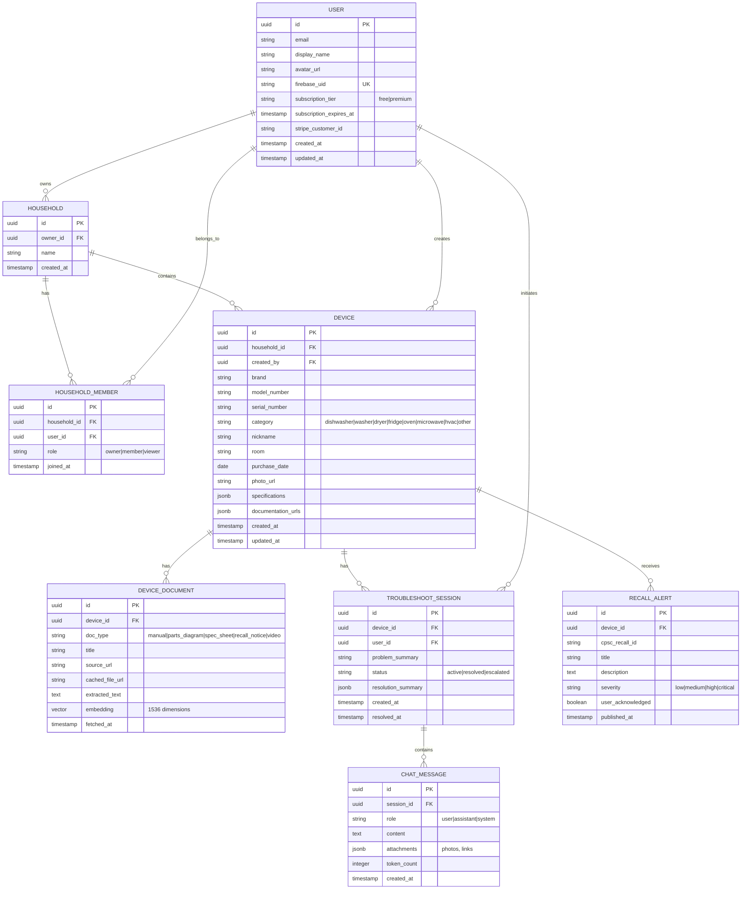

# HelpMyAppliances — AI-Powered Appliance Troubleshooting Platform

## Overview

A cross-platform (Android + Web) application that lets users photograph any home appliance's model number plate, automatically identifies the appliance, retrieves all available documentation, and provides AI-powered interactive troubleshooting — like having a repair technician on a video call. The app builds persistent device profiles per household, creating a living knowledge base for every appliance a user owns.

**Monetization:** Freemium + Subscription ($9.99/mo or $79.99/yr)
**Platforms:** Android (Flutter) + Web (Flutter Web) — simultaneous launch
**AI Provider:** EURI API ecosystem (api.euron.one — OpenAI-compatible gateway to 50+ models)
**Deployment:** Google Cloud Platform (Cloud Run, Cloud SQL, Firebase Auth)
**Auth:** Google OAuth via Firebase Auth (any Gmail user)

## Problem Statement

Home appliance troubleshooting is fragmented and frustrating:

1. **Finding the model number** requires crawling behind/under appliances and reading worn labels
2. **Finding documentation** means searching across manufacturer sites, repair forums, YouTube, and parts suppliers — each with different UX and reliability
3. **Troubleshooting** requires piecing together advice from multiple sources with no guarantee of accuracy or completeness
4. **No continuity** — each time a problem occurs, the user starts from scratch
5. **No single source of truth** for all appliances in a home

HelpMyAppliances solves this by creating an AI-powered, persistent, per-device knowledge hub with interactive troubleshooting.

## Proposed Solution

### Core User Journey

```
[Take Photo] → [AI Extracts Model #] → [User Confirms] → [Fetch Documentation]
      ↓                                                          ↓
[Device Profile Created] ← ← ← ← ← ← ← ← ← ← ← [Store All Data]
      ↓
[Describe Problem] → [AI Troubleshooting Chat] → [Step-by-Step Guidance]
      ↓                       ↓                          ↓
[History Saved]     [Video/Visual Aids]          [Parts Links]
```

### Key Features

1. **Smart Scan** — Photo → OCR → Model number extraction with manual fallback
2. **Auto-Documentation** — Retrieve manuals, specs, parts diagrams, recall notices, repair videos
3. **AI Troubleshooter** — Conversational repair assistant with streaming responses
4. **Device Profiles** — Persistent per-appliance knowledge base with full history
5. **Home Management** — Organize all appliances by household/room
6. **Safety Alerts** — Proactive recall notifications via CPSC API
7. **Visual Guidance** — Curated repair videos and step-by-step visual instructions

## Technical Approach

### Architecture

```
┌─────────────────────────────────────────────────────────────┐
│                     CLIENT LAYER                            │
│  ┌─────────────────┐     ┌─────────────────────────────┐   │
│  │  Flutter Android │     │      Flutter Web             │   │
│  │  (Material 3)    │     │  (Same codebase, PWA)       │   │
│  └────────┬─────────┘     └──────────┬──────────────────┘   │
│           │                          │                       │
│           └──────────┬───────────────┘                       │
│                      │ HTTPS / SSE                           │
└──────────────────────┼───────────────────────────────────────┘
                       │
┌──────────────────────┼───────────────────────────────────────┐
│                  GCP CLOUD RUN                               │
│  ┌───────────────────┴──────────────────────────────────┐   │
│  │              FastAPI Backend                           │   │
│  │  ┌──────────┐ ┌───────────┐ ┌─────────────────────┐ │   │
│  │  │ Auth API │ │ Device API│ │ Troubleshoot API    │ │   │
│  │  │(Firebase)│ │ (CRUD)    │ │ (Streaming SSE)     │ │   │
│  │  └──────────┘ └───────────┘ └─────────┬───────────┘ │   │
│  │  ┌──────────┐ ┌───────────┐           │             │   │
│  │  │ Scan API │ │ Search API│           │             │   │
│  │  │ (OCR)    │ │ (Docs)    │           │             │   │
│  │  └──────────┘ └───────────┘           │             │   │
│  └───────────────────────────────────────┼──────────────┘   │
│                                          │                   │
│  ┌───────────────────────────────────────┼──────────────┐   │
│  │            SERVICES LAYER             │              │   │
│  │  ┌───────────┐  ┌────────────┐  ┌────┴──────────┐  │   │
│  │  │ EURI API  │  │ Web Scraper│  │ RAG Engine    │  │   │
│  │  │ (Vision,  │  │ (Docs,     │  │ (pgvector +   │  │   │
│  │  │  Chat,    │  │  Parts,    │  │  embeddings)  │  │   │
│  │  │  Embed)   │  │  Videos)   │  │               │  │   │
│  │  └───────────┘  └────────────┘  └───────────────┘  │   │
│  └──────────────────────────────────────────────────────┘   │
│                                                              │
│  ┌──────────────────────────────────────────────────────┐   │
│  │            DATA LAYER                                 │   │
│  │  ┌────────────┐  ┌──────────────┐  ┌──────────────┐ │   │
│  │  │ Cloud SQL  │  │ Cloud Storage│  │ Redis        │ │   │
│  │  │ PostgreSQL │  │ (Photos,     │  │ (Cache,      │ │   │
│  │  │ + pgvector │  │  PDFs)       │  │  Sessions)   │ │   │
│  │  └────────────┘  └──────────────┘  └──────────────┘ │   │
│  └──────────────────────────────────────────────────────┘   │
└──────────────────────────────────────────────────────────────┘

┌──────────────────────────────────────────────────────────────┐
│                  EXTERNAL SERVICES                            │
│  ┌──────────┐ ┌──────────┐ ┌────────┐ ┌─────────────────┐  │
│  │ EURI API │ │ CPSC API │ │ YouTube│ │ Stripe /        │  │
│  │ Gateway  │ │ (Recalls)│ │ Data   │ │ RevenueCat      │  │
│  └──────────┘ └──────────┘ │ API v3 │ └─────────────────┘  │
│  ┌──────────┐ ┌──────────┐ └────────┘ ┌─────────────────┐  │
│  │ Energy   │ │ Firebase │              │ Manufacturer   │  │
│  │ Star API │ │ Auth     │              │ Sites (scrape) │  │
│  └──────────┘ └──────────┘              └─────────────────┘  │
└──────────────────────────────────────────────────────────────┘
```

### Technology Stack

| Layer | Technology | Rationale |
|---|---|---|
| **Frontend** | Flutter 3.x (Dart) | Single codebase for Android + Web, Material 3, strong camera/image support |
| **Backend** | Python 3.12 + FastAPI | Async-native, best AI/ML ecosystem, OpenAI SDK compatibility with EURI |
| **Database** | PostgreSQL 16 (Cloud SQL) + pgvector | Relational data + vector embeddings for semantic search over manuals |
| **Cache** | Redis (Memorystore) | Session cache, API response cache, rate limiting |
| **Object Storage** | Cloud Storage | User photos, cached PDFs, processed images |
| **Auth** | Firebase Authentication | Google OAuth, handles token lifecycle, free tier generous |
| **AI Gateway** | EURI API (api.euron.one) | Access to Gemini (vision), Claude (reasoning), GPT-4 (chat) via single API |
| **Payments** | RevenueCat (Android) + Stripe (Web) | Unified subscription management across platforms |
| **CI/CD** | GitHub Actions → Cloud Run | Auto-deploy on merge to main |
| **Monitoring** | Cloud Logging + Cloud Monitoring | GCP-native observability |

### Data Model (ERD)



### Implementation Phases

#### Phase 1: Foundation (Weeks 1-4) — MVP Core

**Goal:** User can scan an appliance, get a device profile, and chat with AI about problems.

**Backend (`backend/`):**
- [ ] `backend/app/main.py` — FastAPI app initialization, CORS, middleware
- [ ] `backend/app/core/config.py` — Settings via pydantic-settings (EURI API key, DB URL, Firebase config)
- [ ] `backend/app/core/security.py` — Firebase JWT token verification middleware
- [ ] `backend/app/models/` — SQLAlchemy models: User, Household, Device, TroubleshootSession, ChatMessage
- [ ] `backend/app/api/v1/auth.py` — POST `/auth/verify` — validate Firebase token, create/get user
- [ ] `backend/app/api/v1/devices.py` — CRUD endpoints for devices
- [ ] `backend/app/api/v1/scan.py` — POST `/scan/photo` — accept image, call EURI Gemini vision for model # extraction
- [ ] `backend/app/api/v1/troubleshoot.py` — POST `/troubleshoot/sessions`, GET `/troubleshoot/sessions/{id}/stream` (SSE)
- [ ] `backend/app/services/ocr_service.py` — EURI vision API integration for model number extraction
- [ ] `backend/app/services/chat_service.py` — EURI chat completion with streaming, context management
- [ ] `backend/app/services/device_lookup_service.py` — Basic model number search (Energy Star API, CPSC API)
- [ ] `backend/alembic/` — Database migrations
- [ ] `backend/Dockerfile` — Container for Cloud Run deployment
- [ ] `backend/requirements.txt` — Dependencies

**Frontend (`frontend/`):**
- [ ] `frontend/lib/main.dart` — App entry, routing, theme (Material 3)
- [ ] `frontend/lib/core/auth/` — Firebase Auth integration, Google Sign-In flow
- [ ] `frontend/lib/core/api/` — HTTP client (Dio), API service classes, auth interceptor
- [ ] `frontend/lib/features/home/` — Home screen with device grid
- [ ] `frontend/lib/features/scan/` — Camera capture screen, image preview, OCR result confirmation
- [ ] `frontend/lib/features/device/` — Device profile detail screen
- [ ] `frontend/lib/features/troubleshoot/` — Chat UI with streaming message display
- [ ] `frontend/lib/models/` — Dart data classes (Device, Session, Message)
- [ ] `frontend/lib/providers/` — Riverpod state management

**Infrastructure:**
- [ ] `infra/terraform/` — GCP resources: Cloud Run, Cloud SQL, Cloud Storage, Redis, Firebase project
- [ ] `infra/cloudbuild.yaml` — CI/CD pipeline
- [ ] `.github/workflows/ci.yml` — Lint, test, build on PR
- [ ] `.github/workflows/deploy.yml` — Deploy to Cloud Run on merge to main

**Acceptance Criteria — Phase 1:**
- [ ] User can sign in with Google account
- [ ] User can take/upload a photo and get model number extracted
- [ ] User can confirm or manually edit the extracted model number
- [ ] Device profile is created with basic info (brand, model, category)
- [ ] User can start a troubleshooting chat for any device
- [ ] AI responses stream in real-time via SSE
- [ ] Chat history is persisted and viewable
- [ ] Works on both Android and Web

#### Phase 2: Knowledge Engine (Weeks 5-10)

**Goal:** Rich appliance documentation retrieval, RAG-powered troubleshooting, and device management.

- [ ] `backend/app/services/scraper/` — Web scraping service for manufacturer manuals, RepairClinic, PartSelect
- [ ] `backend/app/services/scraper/manufacturer_scraper.py` — Fetch manuals from top 20 manufacturer sites
- [ ] `backend/app/services/scraper/repair_sites_scraper.py` — Parts diagrams and symptom-based lookup
- [ ] `backend/app/services/scraper/youtube_service.py` — YouTube Data API v3 integration for repair videos
- [ ] `backend/app/services/rag_service.py` — RAG pipeline: chunk documents → embed via EURI → store in pgvector → retrieve relevant context for chat
- [ ] `backend/app/services/recall_service.py` — CPSC API polling, match to user devices, push notifications
- [ ] `backend/app/api/v1/documents.py` — GET `/devices/{id}/documents` — manuals, videos, parts
- [ ] `backend/app/api/v1/search.py` — POST `/search` — semantic search across all device documentation
- [ ] `backend/app/workers/ingestion_worker.py` — Background worker (Cloud Pub/Sub) for document fetching and processing
- [ ] `backend/app/workers/recall_checker.py` — Scheduled job to check CPSC for new recalls

**Frontend:**
- [ ] `frontend/lib/features/device/tabs/documents_tab.dart` — Manuals, videos, parts list
- [ ] `frontend/lib/features/device/tabs/history_tab.dart` — Past troubleshooting sessions
- [ ] `frontend/lib/features/device/tabs/recalls_tab.dart` — Recall alerts
- [ ] `frontend/lib/features/home/household_management.dart` — Create/manage households, rooms
- [ ] `frontend/lib/features/search/` — Global search across all devices and documents
- [ ] Push notification integration for recall alerts

**Acceptance Criteria — Phase 2:**
- [ ] Device profiles show retrieved manuals, parts diagrams, and repair videos
- [ ] AI troubleshooting uses RAG over device documentation for more accurate answers
- [ ] Users can search across all their devices and documents
- [ ] Recall alerts are shown proactively
- [ ] Users can organize devices by household and room
- [ ] Background document ingestion runs asynchronously

#### Phase 3: Monetization & Polish (Weeks 11-16)

**Goal:** Subscription system, free tier limits, production hardening, and premium features.

- [ ] `backend/app/services/subscription_service.py` — Stripe + RevenueCat integration
- [ ] `backend/app/api/v1/subscription.py` — Subscription status, checkout session, portal
- [ ] `backend/app/middleware/rate_limiter.py` — Per-user rate limiting (free: 3 scans/mo, 5 chats/mo; premium: unlimited)
- [ ] `backend/app/middleware/usage_tracker.py` — Track API usage per user for billing/limits

**Frontend:**
- [ ] `frontend/lib/features/subscription/` — Paywall screen, plan comparison, upgrade prompts
- [ ] `frontend/lib/features/subscription/paywall_trigger.dart` — Smart paywall triggers (after free limit hit)
- [ ] `frontend/lib/features/settings/` — Account settings, subscription management, data export
- [ ] `frontend/lib/features/onboarding/` — First-time user onboarding flow

**Premium Features:**
- [ ] Unlimited device scans and troubleshooting sessions
- [ ] Priority AI model access (GPT-4/Claude over free-tier Gemini Flash)
- [ ] Offline access to cached device profiles and past conversations
- [ ] Household sharing (invite family members)
- [ ] Parts price comparison across suppliers
- [ ] Scheduled maintenance reminders

**Free Tier Limits:**
| Feature | Free | Premium ($9.99/mo) |
|---|---|---|
| Device scans | 3/month | Unlimited |
| Troubleshoot sessions | 5/month | Unlimited |
| Devices saved | 3 | Unlimited |
| Household members | 1 (self) | Up to 6 |
| AI model | Gemini Flash | GPT-4 / Claude |
| Offline access | No | Yes |
| Recall alerts | Yes | Yes |

**Acceptance Criteria — Phase 3:**
- [ ] Stripe checkout works on web, Google Play Billing on Android (via RevenueCat)
- [ ] Free tier limits are enforced gracefully with clear upgrade prompts
- [ ] Subscription status syncs across platforms
- [ ] Onboarding flow guides new users through first scan
- [ ] App passes Google Play review requirements (privacy policy, account deletion)

#### Phase 4: Growth & Advanced Features (Weeks 17-24)

**Goal:** Advanced AI features, community, and scale.

- [ ] **AR Overlay** — Use device camera to overlay repair step annotations on the appliance in real-time (ARCore)
- [ ] **Voice Input** — Describe problems by voice (EURI Whisper STT), hands-free troubleshooting
- [ ] **Appliance Health Score** — AI-estimated remaining lifespan based on age, usage patterns, and common failure modes
- [ ] **Community Features** — User-submitted tips and fixes, upvote/downvote, verified repair tags
- [ ] **Pro/B2B Tier** — White-label API for property managers, landlords, repair companies
- [ ] **Analytics Dashboard** — Most common problems by model, trending issues, cost-to-repair estimates
- [ ] **Multi-language Support** — i18n for top 10 languages
- [ ] **iOS App** — Flutter makes this straightforward once Android + Web are stable

## Alternative Approaches Considered

| Approach | Why Rejected |
|---|---|
| **React Native** instead of Flutter | Flutter's web support is more mature; single codebase shares ~95% code vs RN's ~80% |
| **Firebase Firestore** instead of PostgreSQL | Firestore's query limitations and pricing at scale are prohibitive; pgvector needed for RAG |
| **Google Vertex AI** instead of EURI | User specified EURI; EURI provides access to same models (Gemini, Claude) via single gateway |
| **Separate Android + Web codebases** | 2x development cost, harder to maintain feature parity |
| **Node.js/Express backend** | Python has stronger AI/ML ecosystem, better EURI SDK support |
| **GKE** instead of Cloud Run | Over-engineered for this scale; Cloud Run scales to zero and auto-scales |

## Acceptance Criteria

### Functional Requirements
- [ ] Users can sign in with any Google account
- [ ] Photo capture extracts model number with >90% accuracy on clear labels
- [ ] Manual entry fallback when OCR fails or confidence is low
- [ ] Device profiles persist all documentation and troubleshooting history
- [ ] AI troubleshooting provides relevant, context-aware step-by-step guidance
- [ ] Streaming chat responses with <2 second time-to-first-token
- [ ] Subscription upgrade/downgrade works on both platforms
- [ ] Device recall alerts are delivered within 24 hours of CPSC publication

### Non-Functional Requirements
- [ ] API response time <500ms (p95) excluding AI generation
- [ ] 99.9% uptime (Cloud Run SLA)
- [ ] Support 10,000 concurrent users at launch
- [ ] GDPR-compliant data handling with account deletion support
- [ ] All user photos encrypted at rest (Cloud Storage default encryption)
- [ ] SOC 2 Type I readiness by Phase 4

### Quality Gates
- [ ] >80% backend test coverage (pytest)
- [ ] >70% frontend test coverage (Flutter test)
- [ ] All API endpoints have OpenAPI documentation
- [ ] Accessibility: WCAG 2.1 AA compliance
- [ ] Lighthouse score >90 for web app
- [ ] Android app size <50MB

## Safety & Liability

**Critical:** The app provides repair guidance for appliances that may involve electricity, gas, water, and refrigerants.

- [ ] **Safety disclaimer** shown before every troubleshooting session: "This is AI-generated guidance. For gas leaks, electrical hazards, or if you feel unsafe, contact a licensed professional."
- [ ] **Hazard detection** — AI system prompt includes safety rules: flag high-voltage, gas, and refrigerant steps with warnings
- [ ] **"Call a Pro" button** — Always visible during troubleshooting, links to local repair services
- [ ] **User feedback** — Thumbs up/down on every AI response to flag bad advice
- [ ] **Terms of Service** — Clear liability limitation for repair outcomes
- [ ] **Content moderation** — Log and review flagged AI responses weekly

## Dependencies & Prerequisites

| Dependency | Status | Risk |
|---|---|---|
| EURI API access (api.euron.one) | Need API key | Low — free tier available |
| GCP account (pbit82@gmail.com) | Need project setup | Low |
| GitHub repo (prashilbulbule13@gmail.com) | Need to create | Low |
| Firebase project | Need to create | Low |
| Stripe account | Need to create | Low — straightforward signup |
| RevenueCat account | Need to create | Low |
| Google Play Developer account ($25) | Need to create | Low |
| CPSC API | Public, no key needed | Low |
| Energy Star API | Public, free | Low |
| YouTube Data API | Need API key | Low — free tier: 10K units/day |

## Risk Analysis & Mitigation

| Risk | Impact | Likelihood | Mitigation |
|---|---|---|---|
| EURI API downtime | Users can't scan or chat | Medium | Fallback to direct Gemini API; cache recent responses |
| OCR accuracy on worn labels | Poor UX, user frustration | High | Manual entry fallback, multi-candidate selection, image preprocessing |
| AI hallucination (wrong repair steps) | Safety hazard, liability | High | RAG grounding, safety system prompt, disclaimer, user feedback loop |
| Web scraping blocked by manufacturers | Incomplete documentation | Medium | Prioritize API sources (Energy Star, CPSC), link to manufacturer sites instead of hosting content |
| Google Play Billing complexity | Delayed Android launch | Medium | RevenueCat abstracts most complexity; budget extra QA time |
| EURI API cost scaling | Unexpected bills | Medium | Token budgets per user tier, caching, use cheaper models for simple queries |

## Success Metrics

| Metric | Target (Phase 1) | Target (Phase 4) |
|---|---|---|
| Monthly Active Users | 1,000 | 50,000 |
| Scan-to-Profile Conversion | >70% | >85% |
| Troubleshoot Session Completion | >50% | >70% |
| Free-to-Paid Conversion | 5% | 10% |
| Monthly Recurring Revenue | $500 | $25,000 |
| App Store Rating | 4.0+ | 4.5+ |
| AI Response Accuracy (user thumbs up) | >75% | >90% |

## Resource Requirements

- **GCP estimated cost:** ~$150-300/mo at launch (Cloud Run scales to zero, Cloud SQL small instance, Cloud Storage)
- **EURI API:** Free tier for development; ~$200-500/mo at scale depending on usage
- **Stripe:** 2.9% + $0.30 per transaction
- **RevenueCat:** Free up to $2.5K MTR, then 1% of revenue
- **Google Play Developer:** $25 one-time
- **Domain + SSL:** ~$12/yr

## Documentation Plan

- [ ] API documentation via FastAPI auto-generated OpenAPI/Swagger
- [ ] User-facing help center (Notion or similar)
- [ ] Privacy Policy and Terms of Service (required for Google Play)
- [ ] Developer onboarding guide in repo README
- [ ] Architecture Decision Records (ADRs) for major technical decisions

## References & Research

### External References
- [EURI API Docs](https://docs.euron.one) — AI gateway documentation
- [euriai Python SDK](https://pypi.org/project/euriai/) — Python client library
- [CPSC Recalls API](https://www.saferproducts.gov/RestWebServices) — Product recall data
- [Energy Star API](https://data.energystar.gov) — Appliance specifications
- [YouTube Data API v3](https://developers.google.com/youtube/v3) — Video search
- [Flutter Documentation](https://docs.flutter.dev) — Frontend framework
- [FastAPI Documentation](https://fastapi.tiangolo.com) — Backend framework
- [RevenueCat Docs](https://www.revenuecat.com/docs) — Subscription management
- [Firebase Auth](https://firebase.google.com/docs/auth) — Authentication

### Accounts Required
- **GitHub:** prashilbulbule13@gmail.com — Source code repository
- **GCP:** pbit82@gmail.com — Cloud infrastructure and deployment
- **EURI:** Sign up at euri.ai — AI API access
- **Stripe:** New account needed — Web payments
- **RevenueCat:** New account needed — Mobile subscription management
